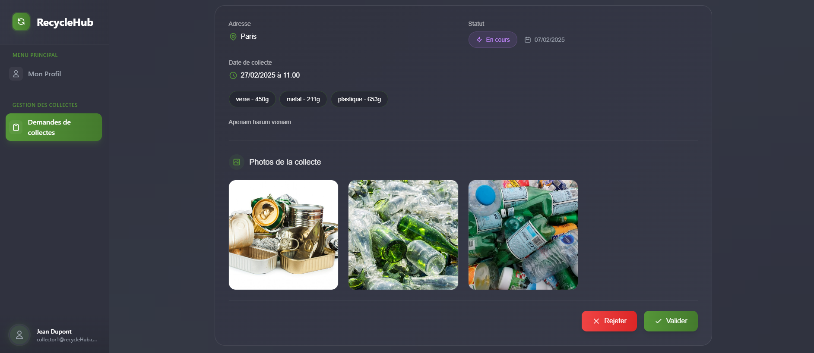

# 🌱 RecycleHub

## 📋 Table des matières
- [À propos du projet](#-à-propos-du-projet)
- [Technologies utilisées](#-technologies-utilisées)
- [Fonctionnalités](#-fonctionnalités)
- [Installation](#-installation)
- [Structure du projet](#-structure-du-projet)
- [Captures d'écran](#-captures-décran)

## 🌟 À propos du projet
RecycleHub est une application web moderne de gestion de recyclage qui facilite la mise en relation entre particuliers et collecteurs agréés. Cette Single Page Application (SPA) vise à automatiser et simplifier le processus de recyclage.

## 🛠 Technologies utilisées
-  Angular 17
-  TypeScript
-  NgRx pour la gestion d'état
-  RxJS
-  Tailwind CSS

## ✨ Fonctionnalités

### 👤 Authentification
- Inscription (particuliers)
- Connexion sécurisée
- Gestion de profil
- Suppression de compte

### 📦 Gestion des collectes
- Soumission de demandes de collecte
- Suivi des statuts en temps réel
- Modification/suppression des demandes en attente
- Limite de 3 demandes simultanées
- Maximum 10kg par collecte

### 🚛 Interface collecteur
- Visualisation des demandes par ville
- Gestion des statuts de collecte
- Validation des matériaux sur place
- Prise de photos

### 💰 Système de points
- Attribution automatique selon barème :
  - Plastique : 2 pts/kg
  - Verre : 1 pt/kg
  - Papier : 1 pt/kg
  - Métal : 5 pts/kg
- Conversion en bons d'achat :
  - 100 pts ➡️ 50 Dh
  - 200 pts ➡️ 120 Dh
  - 500 pts ➡️ 350 Dh

## 🚀 Installation
```bash
# Cloner le projet
git clone https://github.com/asmaabarj/recyclehub.git

# Installer les dépendances
cd recyclehub
npm install

# Lancer le serveur de développement
ng serve

# Accéder à l'application
http://localhost:4200
```

## 📁 Structure du projet
```
recyclehub/
├── src/
│   ├── app/
│   │   ├── core/
│   │   │   ├── guards/
│   │   │   ├── interceptors/
│   │   │   ├── models/
│   │   │   ├── services/
│   │   │   └── state/
│   │   ├── features/
│   │   │   ├── auth/
│   │   │   ├── collection/
│   │   │   └── profile/
│   │   └── shared/
│   │       ├── components/
│   │       ├── directives/
│   │       └── pipes/
│   ├── assets/
│   └── environments/
```

## �� Captures d'écran

<details>
<summary>🖼️ Voir les captures d'écran</summary>

### 🏠 Page d'accueil


### 🔐 Authentification
<div align="center">
  
  
</div>

### 👤 Profil Utilisateur


### 📦 Gestion des Collectes
<div align="center">
  <table>
    <tr>
      <td></td>
      <td></td>
    </tr>
  </table>
</div>

### 💰 Système de Points


</details>

> 💡 Cliquez sur "Voir les captures d'écran" pour afficher toutes les images

### 🎥 Démo en direct
Voir la démo : [RecycleHub Demo](https://votre-lien-demo.com)

## 🔒 Sécurité
- Authentification sécurisée
- Protection des routes avec Guards
- Validation des formulaires
- Gestion des erreurs

## 🌐 État de l'application
Gestion centralisée avec NgRx :
- Actions
- Reducers
- Effects
- Selectors


